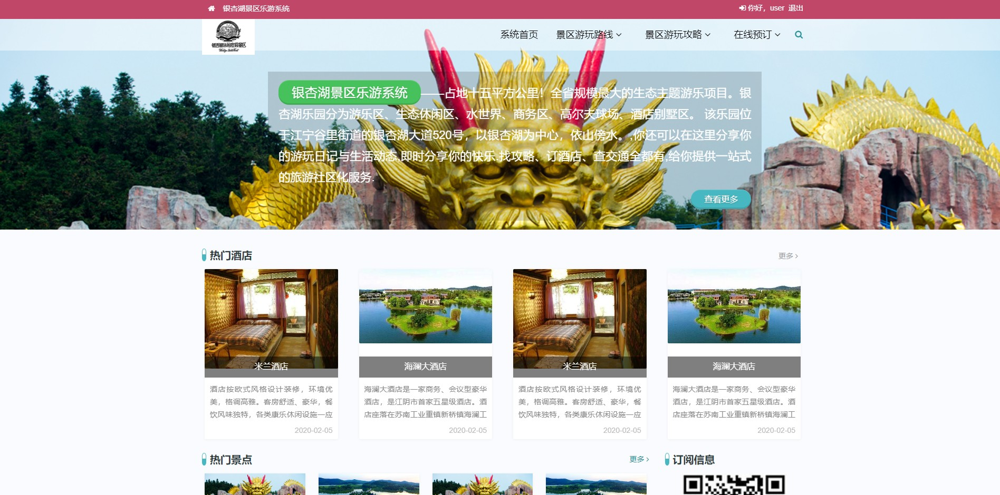
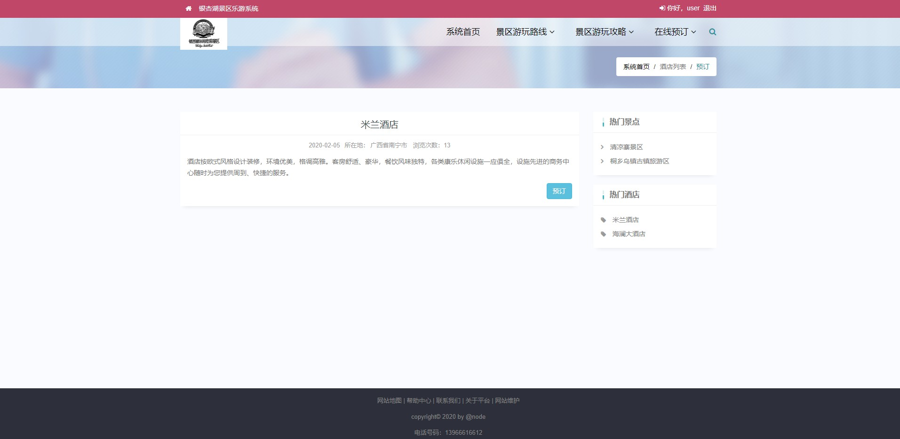
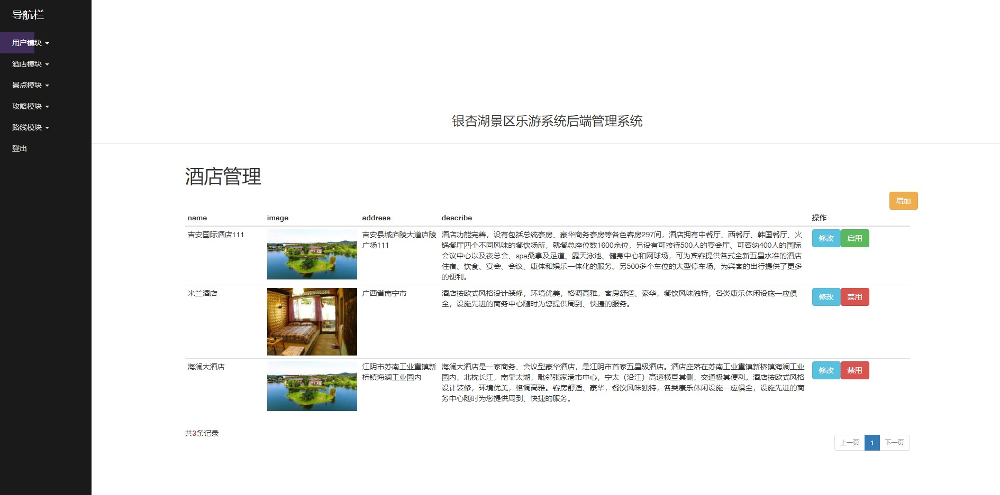
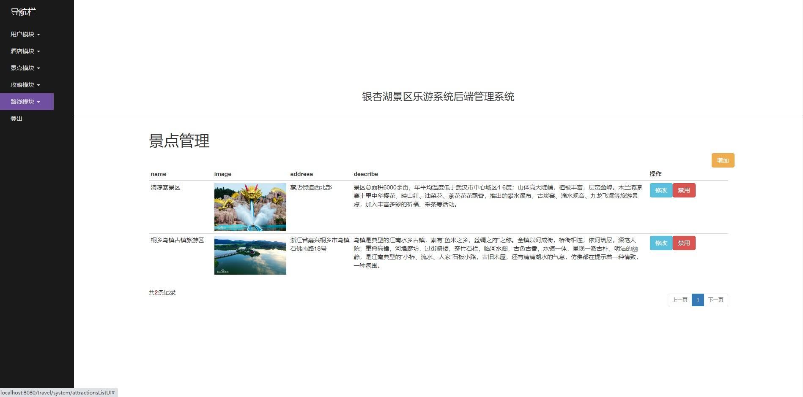
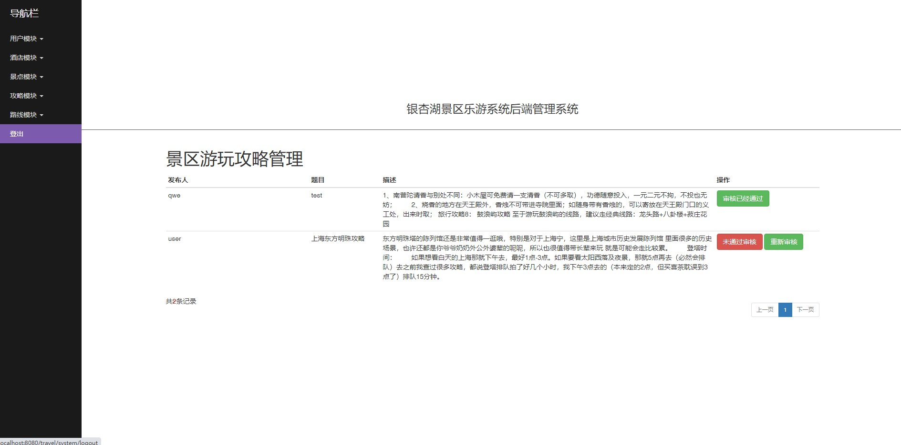

 **郑重声明：项目经过本地测试，确保可以运行， 可以用于学习和毕业设计参考~** 

[点我获取源码](https://x-x.fun/e/ZWf87f45b1NRq)💕🤞

[点我查看更多](http://blog.cyrobot.top/blog)💕🤞

#### 1.项目介绍

- 门户网站：首页、酒店/景点在线预订、景区游玩路线、景区游玩攻略
- 后台功能：用户管理、酒店管理、景区管理、攻略管理、路线管理等

#### 2.本地部署

- 创建数据库，导入travel.sql
- 打开IDEA,导入项目，修改数据库连接：src/main/resources/application.yml
- 运行项目
- 前端访问：http://localhost:8080/travel/    user/123456
- 后端访问：http://localhost:8080/travel/system    admin/admin
#### 3.项目部分截图
